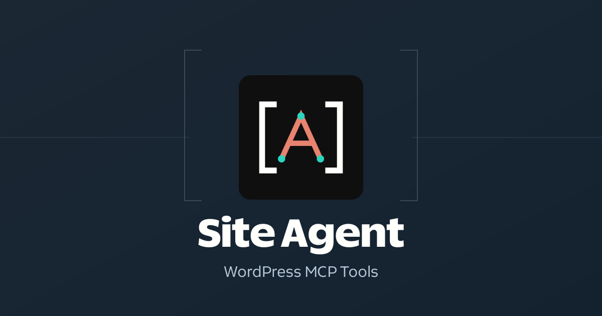

# Site Agent



[Get Site Agent](https://gauravtiwari.org/product/site-agent/) · [Releases](https://github.com/wpgaurav/site-agent/releases) · [Security](SECURITY.md)

Site Agent connects an MCP client directly to WordPress. It provides site context, content and media discovery, content writes, plugin and theme source inspection, source editing, PHP execution, and foreground WP-CLI commands.

Site Agent is free and open source. The complete release ZIP and a free automatic-update license are available from [gauravtiwari.org](https://gauravtiwari.org/product/site-agent/). It runs independently of Functionalities. This repository is the public source; install the release ZIP, which includes the official scoped MCP runtime.

## Companion Package

Release 0.2.0 also includes `site-agent-companion-0.2.0.zip`, built from `companion/site-agent/`. It supplies the approved icon, a credential-free MCP connection and a WordPress workflow skill for compatible ChatGPT/Codex hosts. The skill covers site inspection, raw-content audits, draft preparation, hash-checked edits and enabled developer tools.

This companion archive is separate from the WordPress installable ZIP. Authentication must be configured privately through a compatible host. It does not implement OAuth or establish authenticated ChatGPT web connectivity. The server requires a WordPress Application Password through a Basic Authorization header or explicitly enabled URL authentication. OAuth remains unimplemented, and ChatGPT web compatibility with credential-bearing URLs has not been verified.

Build and validate the companion with `python3 bin/build-companion.py`. Never include credentials in its manifests or archive.

## Requirements and Installation

- WordPress 6.9 or newer; PHP 8.0 or newer.
- HTTPS for remote connections; HTTP is accepted only with `WP_ENVIRONMENT_TYPE=local`.
- Administrator access, or super administrator access on multisite.
- An MCP client with Streamable HTTP and an HTTP Basic Authorization header, or a compatible Application Password bridge.
- WP-CLI in `/usr/local/bin/wp`, `/usr/bin/wp`, or `/opt/homebrew/bin/wp`, and `proc_open`, for the WP-CLI tool only.

Upload the complete ZIP through Plugins → Add New → Upload Plugin. Open Tools → Site Agent. Enable access and select each tool group. Create a dedicated WordPress Application Password in the administrator's profile. Use the endpoint and connection template shown on the settings page.

The settings page includes a browser-only credential converter. Enter your WordPress username and a dedicated Application Password, then copy the Base64 token, complete Authorization value or MCP configuration. Spaced passwords and UTF-8 usernames are supported. Inputs have no form names and are not submitted or stored by Site Agent. Clear credentials after copying; generated values are also cleared when you edit the inputs or navigate away. Your system clipboard retains what you copy until you replace it.

The usual endpoint is `/wp-json/site-agent/v1/mcp`. Sites with plain permalinks use the equivalent `?rest_route=/site-agent/v1/mcp` URL shown in the settings. Encode `username:application-password` as Base64 and pass it in `Authorization: Basic …`. Base64 is not encryption; remote transport requires HTTPS.

The settings page includes an inline guide with setup steps, a site-specific URL example, credential privacy and revocation instructions. For clients without custom headers, enable **URL authentication** in Tools → Site Agent, save, and use **Copy authenticated endpoint** in the converter. The format is `/wp-json/site-agent/v1/mcp?auth=BASE64_VALUE`; the converter percent-encodes the value and preserves existing query parameters on plain-permalink sites. Standard and URL-safe Base64 are accepted. The value must decode to `username:application-password`; an account password is rejected. Each request validates the Application Password through WordPress and rechecks administrator and enabled-tool permissions. Revoking that password stops URL access, including existing MCP sessions.

URL authentication is off by default and applies only to the Site Agent MCP route. It accepts query credentials, not credentials inside tool arguments. Invalid supplied tokens fail closed, including when another identity was authenticated. MCP responses are marked private/no-store. HTTPS remains required remotely. Credentials in URLs may be recorded in browser history, proxy/server logs or client configuration; Base64 is reversible. Use a dedicated, revocable Application Password and keep the complete URL private. The client must support the MCP transport/protocol and preserve the query on each request; this is not a guarantee of compatibility with every client.

All access and write/execution tool groups are off on installation. Deactivation also disables access. Revoke access by disabling Site Agent or deleting the dedicated Application Password. An emergency stop is available in `wp-config.php`:

```php
define( 'SITE_AGENT_DISABLED', true );
```

## Tools

| Tool | Opt-in group | Behavior |
| --- | --- | --- |
| `site-agent-site-context` | Enable Site Agent | WordPress/PHP versions, plugins, theme, active page builders, REST post types and taxonomies, tools available to this connection |
| `site-agent-list-content` | Enable Site Agent | Search and paginate accessible content, most recently modified first |
| `site-agent-get-content` | Enable Site Agent | Read by ID, URL or slug: raw content, terms, featured image, SEO meta, newer autosave, the builder that stores the layout, content hash |
| `site-agent-list-terms` | Enable Site Agent | Find categories, tags and other taxonomy terms |
| `site-agent-list-media` | Enable Site Agent | Existing media URLs, MIME types, dimensions, and alt text |
| `site-agent-list-skills` | Enable Site Agent | Bundled page builder skills, whether each builder is active, and each skill's files |
| `site-agent-get-skill` | Enable Site Agent | Read a builder skill's SKILL.md, references, patterns or examples |
| `site-agent-save-content` | Content writes | Create drafts or update posts, terms, featured image, slug, schedule and SEO meta through core APIs |
| `site-agent-upload-media` | Content writes | Import a public URL or base64 file into the media library with alt text |
| `site-agent-update-media` | Content writes | Set media title, alt text, caption and description |
| `site-agent-list-files` | Source inspection | Browse plugin, theme and must-use plugin directories |
| `site-agent-read-file` | Source inspection | Read UTF-8 source with a SHA-256 hash |
| `site-agent-write-file` | Source editing | Compare current hash, check PHP, lock, write, then load the site and revert fatal changes |
| `site-agent-create-directory` | Source editing | Create directories and missing parents |
| `site-agent-delete-file` | Source editing | Delete a hash-matched file or an empty directory |
| `site-agent-move-file` | Source editing | Rename a hash-matched file to a new path |
| `site-agent-execute-php` | PHP execution | Run PHP inside the loaded WordPress request |
| `site-agent-run-wp-cli` | WP-CLI execution | Run argument-array commands on this installation |

Every tool argument has a schema description, and every tool declares an output schema. Errors report the underlying message and line, because the caller already controls the failing code.

Content creates default to drafts. Updates require `expected_content_sha256`; omitted fields are preserved. Edits to a published, private or scheduled post are saved as the user's autosave (shown in the editor for review) unless the call passes `status`; publishing and scheduling always require an explicit status, and `future` needs a future `date_gmt`. Titles are stored as plain text without stripping tag-like text or percent sequences. Terms accept IDs or names (missing names are created). Meta writes are limited to Rank Math or Yoast SEO fields when those plugins are active, single scalar meta registered with `show_in_rest`, and keys added through the `site_agent_post_meta_keys` filter. Elementor, Bricks and Divi layout meta (`_elementor_*`, `_bricks_*`, `_et_*`) is excluded even when registered for REST, because a raw write skips the builder's validation and cache refresh; the builder skills describe the safe routes, and the filter can still add a key deliberately. Core save hooks, revisions, and the author's HTML filtering apply. Content hashes detect intervening changes before a save; they are not a database transaction or a replacement for backups.

Media imports use `wp_safe_remote_get()` (no private or loopback hosts) within WordPress's upload size limit, or base64 data up to 10 MiB, and pass through core's file type checks.

File tools operate only under `wp-content/plugins`, `wp-content/themes`, and `wp-content/mu-plugins`. Hidden (dot) paths, symlinks, and credential files such as `wp-config*.php`, `auth.json`, `credentials.json`, `secrets.*`, service-account JSON, and key files are blocked; the `site_agent_file_blocked` filter can block more. Ordinary files such as `tailwind.config.js` remain accessible. Source files may still contain sensitive data, so source inspection is an explicit opt-in. Source editing cannot rewrite Site Agent's own files. File content is bounded to 256 KiB. Writes, moves and deletes require the current `expected_sha256` (or `new` for a new file and `directory` for an empty directory). The file's current hash is checked under an exclusive lock.

PHP changes pass three checks. The tokenizer catches syntax errors; a matching PHP command-line binary (`SITE_AGENT_PHP_BINARY`, or one found automatically) catches compile errors such as redeclared functions; then, after the write, Site Agent loads the front end, an admin request, and the MCP route with WordPress's own edit-scrape mechanism, as the core plugin editor does, and reverts the change if it causes a fatal error. Must-use plugins load before WordPress starts scraping, so for `mu-plugins/` a server error counts as fatal. If the site cannot be reached, the change is kept and the result reports `health: unverified`. The `site_agent_health_check` and `site_agent_health_check_urls` filters control this check. None of this is a transactional deployment or proof that a change works.

PHP code is limited to 64 KiB. Output and JSON return values are each limited to 64 KiB. PHP runs in the WordPress process and is **not sandboxed**. Code containing `exit` or `die` is rejected, `wp_die()` becomes a tool error, and an early end of the request (for example a fatal error or `exit()` reached indirectly) is reported to the client as a tool error and recorded in the audit history. Infinite loops, memory exhaustion, or changes to output buffers can still disrupt the request. Use it on backed-up development or staging sites. PHP execution, executable file editing, and WP-CLI can each alter other settings or files; the switches control entry points, not isolation boundaries.

WP-CLI runs without a shell, on the current WordPress installation, and as the authenticated user. Identity, connection, bootstrap and `@alias` arguments are rejected. Commands have a 20-second foreground limit by default (`SITE_AGENT_WP_CLI_TIMEOUT` or the `site_agent_wp_cli_timeout` filter, up to 300); stdout/stderr are capped at 64 KiB each. The executable is found in common locations or set with `SITE_AGENT_WP_CLI`. The process inherits the server environment with a `PATH` that includes PHP and a `HOME`, so the WP-CLI phar works under PHP-FPM. Server-disabled functions and missing WP-CLI return a clear availability error. Detached jobs, descendants created by a command, and arbitrary PHP are not contained by this foreground timeout.

`DISALLOW_FILE_EDIT` and `DISALLOW_FILE_MODS` block source inspection, source editing, PHP execution, and WP-CLI entry points. Setting `SITE_AGENT_ALLOW_EXECUTION` to `false` in `wp-config.php` blocks source editing, PHP execution and WP-CLI on that site while leaving content tools and source inspection available. Each Application Password can be limited to a subset of the enabled tool groups under Tools → Site Agent; limited passwords do not see other tools in `tools/list`. Every ability checks authenticated administration rights, its group setting and the password's limit again at execution time. Abilities remain private to the Site Agent server, with no public exposure through the default adapter or core REST ability routes.

The settings page shows diagnostics for HTTPS detection (including proxies that hide HTTPS), Application Password availability, WP-CLI, PHP compile checks and symlinked folders. Its Test connection button calls the MCP endpoint from the browser with the generated token, without cookies, and names the likely cause of a failure. Refused MCP requests carry an `X-Site-Agent-Auth` header with a coarse reason such as `unauthenticated` or `https_required`.

## Builder Skills

Site Agent bundles read-only skills for Gutenberg, GenerateBlocks, Elementor, Bricks and Divi under `skills/`. An MCP client reads them with `site-agent-list-skills` and `site-agent-get-skill`; they need only the base Enable Site Agent switch and contain no site data. Each skill explains where that builder stores layouts, how to read and change them through Site Agent's tools, and how to verify the result.

`site-agent-site-context` lists the active builders, and `site-agent-get-content` reports a post's `builder`: `gutenberg`, `generateblocks`, `elementor`, `bricks`, `divi` or `classic`. Elementor, Bricks and Divi 4 keep the visible layout outside the block markup that `save-content` writes. Their skills either produce paste or import files for the builder's own interface or, when the user asks for a direct change, use the opt-in PHP or WP-CLI tools with a snapshot, a hash check and a read-back. Skills are guidance for the client, not a safety layer; the tool groups and their limits still decide what a connection can do.

The Bricks and GenerateBlocks skills are adapted from the author's [bricks-skills](https://github.com/wpgaurav/bricks-skills) and [generateblocks-skills](https://github.com/wpgaurav/generateblocks-skills) repositories, and the Gutenberg block reference from [WordPress-skills](https://github.com/wpgaurav/WordPress-skills). `skills/sources.json` pins each source commit and the SHA-256 of every imported file. `python3 bin/sync-skills.py` validates the bundled skills offline, and `--pull` re-imports the pinned files.

## Runtime Provenance

All Site Agent application code was written independently. No Novamira source, assets, build scripts, or dependencies are included.

The only bundled third-party runtime packages are the official [WordPress MCP Adapter](https://github.com/WordPress/mcp-adapter) and [WordPress PHP MCP Schema](https://github.com/WordPress/php-mcp-schema), both GPL-2.0-or-later. The adapter is the upcoming **0.7.0 prerelease**, pinned by `composer.lock` to commit `ef6492880f0be9ec501881700a25a18f11953758`. PHP MCP Schema is version 0.2.0. These are not claims that adapter 0.7.0 is released.

`bin/build-runtime.php` copies only those packages' runtime PHP and licenses. It changes their namespaces, adapter-owned hooks/constants, and CLI command name so the bundled adapter can coexist with the canonical plugin. It preserves native WordPress functions/classes and upstream copyright notices. `runtime/manifest.json` records package sources, commits, versions, and licenses. The scoped adapter disables its default discovery server; Site Agent registers a dedicated server with explicitly selected abilities. Future upstream changes may require changes to the scoping procedure.

## Privacy and Updates

Site Agent has no hosted MCP proxy, telemetry or AI provider SDK. Requests go between the configured client and the site. What the client does with tool results is governed by that client/provider's policy. Developer tools can intentionally make outbound requests when instructed to do so.

The optional audit history stores the last 100 calls in a non-autoloaded WordPress option: UTC time, user ID, tool name, target, Application Password name and transport (header, URL or session), result with error code, and elapsed milliseconds. Targets identify what was touched: a post or attachment ID, a file path, the first WP-CLI command words, or the host of an imported URL. Authenticated calls refused by a switch or password limit are recorded as denied. It does not store content, code, other arguments, output, IP addresses, or credential secrets. Concurrent calls may overwrite audit rows; this history is an operational aid, not a tamper-proof security log. Clearing data on uninstall is opt-in.

The `Update URI` header prevents an unrelated WordPress.org plugin with a matching slug from replacing Site Agent. Version 0.1.1 adds native WordPress updates through FluentCart product 1180328 on gauravtiwari.org. Complete the free checkout, then activate its update license under Tools → Site Agent. The license controls automatic update delivery only; every tool remains available without activation.

License activation explicitly sends the key, site URL, plugin version, WordPress version and PHP version to the store. Activated licenses contact the store when WordPress checks updates. License keys and activation hashes are encrypted with Sodium, stored without autoload and bound to the site's home URL. Cloned sites and salt changes require their own activation. Failed connection/deactivation requests preserve credentials. The store's [privacy policy](https://gauravtiwari.org/privacy-policy/) applies to that service.

Update metadata is cached for three hours and partitioned by site, credentials and plugin version. A fresh protected URL is fetched before both single and bulk downloads. Packages require HTTPS on the store or its FluentCart R2 host, and their extracted name/version must match the offered Site Agent release. Invalid licenses never receive a package, and older versions are not offered as updates. Manual release ZIP updates remain available. See [Security and Access](#security-and-access) for the trust model.

OAuth, background WP-CLI jobs, an AI chat UI and a recoverable PHP sandbox are outside this version.

## Security and Access

All access starts disabled. Developer tools run with server privileges, so use trusted clients and backups on development or staging sites. Read [SECURITY.md](SECURITY.md) for permission checks, emergency revocation, update trust and private vulnerability reporting.

## Development

```sh
composer install
composer runtime
composer lint
vendor/bin/phpcs
SITE_AGENT_WP_DIR=/path/to/disposable/wordpress vendor/bin/phpunit
python3 bin/sync-skills.py
bash bin/build.sh
```

Tests refuse to load an installation without a `.site-agent-test-install` marker. Never place that marker on a real site. Integration tests modify disposable options, users, posts, and fixture files. The build uses a runtime allowlist and excludes tests, development dependencies, Composer metadata, docs, and screenshots. Ship `dist/site-agent-0.2.0.zip`, not a GitHub source archive.

## License and Contributions

Site Agent is GPL-2.0-or-later. Original upstream runtime notices and complete licenses are included. See [LICENSE](LICENSE), [runtime provenance](docs/PROVENANCE.md) and [CONTRIBUTING.md](CONTRIBUTING.md). No Novamira application code, assets, scripts or dependencies are included.
